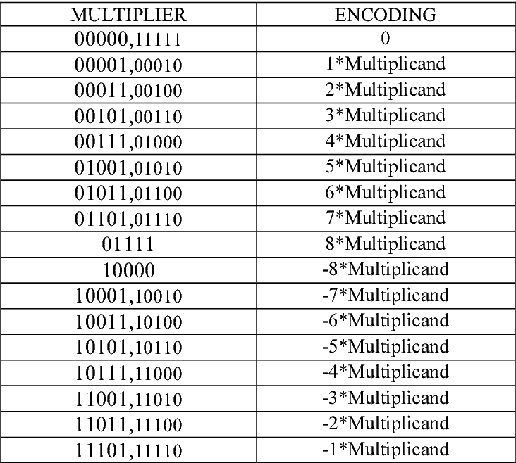

# Tutorial

## Intro

In this tutorial, we will guide you through our implementation of the ECDSA signing algorithm for the secp256k1 curve, using Fully Homomorphic Encryption (FHE). Specifically we use homomorphic boolean operations.

ECDSA signing requires a ``private key``, a ``message`` and a random secret value called ``nonce`` which is only used once.

With this ``nonce`` we perform two computations. First we compute the nonce curve point ``R`` (i.e. the public key that corresponds to ``nonce``) and take its x coordinate. Secondly we compute the ``nonce`` multiplicative modular inverse.

With these two values we compute the ``s`` component of the signature as:
```
s = ((private key * R + message) * nonce^-1) mod N
```

Where N is the order of the generator point, a 256-bit prime number, and ``R`` is the nonce curve point x coordinate.
> N = 115792089237316195423570985008687907852837564279074904382605163141518161494337

The resulting signature is the pair of values ``R``, ``s`` (64 bytes in total without any encoding).

#### Pre-computed values

Here we will not cover elliptic curve operations, used for the public key computation. Therefore, the nonce curve point ``R`` is pre-computed on the client side (in the clear). We will use rust-secp256k1 for this.

The second pre-computed value is the ``nonce`` modular inverse, which can be efficiently computed using Fermat's Little Theorem:

```a^(p-1) ≡ 1 mod p```, where ``p`` is prime and ``a`` is not multiple of ``p``.

We multiply both sides by ``a^-1`` and get: ```a^-1 ≡ a^(p-2) mod p```. We can solve this using the fast exponentiation method.

In other words, we can compute the ``nonce`` modular inverse as: ```nonce^(N-2) mod N```. This is very fast in cleartext, but in FHE it would require many homomorphic multiplications and reductions which makes it impractical (the program would be orders of magnitude slower).

### Program overview

So we have two secret values, ``private key`` and ``nonce^-1``, that need to be encrypted. But we also have two public values, ``message`` and ``R`` (recall that this is the nonce public key), that can be given to the server in the clear.

Hence, our FHE signing function will first multiply an encrypted value with a public one: ``private key * R``. Then add the encrypted result with ``message``. And finally multiply the encrypted result by the encrypted ``nonce^-1``. The result will be the encrypted ``s`` component of the signature.

These operations are just basic school-grade arithmetic (addition and multiplication), but performed modulo N.

Easy! Now let's jump to the modular arithmetic implementations.

## Basic arithmetic operations

We will begin with the plain arithmetic operations, that work with slices and vectors of ``Ciphertext`` (the type that represents an encrypted bool), encoding big endian binary numbers. We use the Rayon crate to parallelize all these implementations.

### Addition

For a highly parallelizable addition we implement the Ladner Fischer Adder.

Most of us are familiar with the traditional addition algorithm known as the Carry Ripple Adder for binary addition. In this method, the operations are inherently sequential, as carries must be propagated from the Least Significant Bits (LSB) to the Most Significant Bits (MSB).

Conversely, the Ladner Fischer Adder combines "propagate" and "generate" signals using a parallel prefix algorithm that replaces the sequential carry propagation.

1. Generate Signal (G): Indicates if the addition of two bits will produce an immediate carry. For binary numbers ``a`` and ``b``, it's given by the bitwise ``a AND b`` (only if we add two ``1`` bits we generate a carry).
2. Propagate Signal (P): Suggests that a carry from a previous stage might be forwarded. It's given by ``a XOR b`` (only if one of the two bits is ``1`` is the carry-in forwarded).
3. We then combine these signals with the Ladner Fischer parallel prefix algorithm and get the Carry Signal.
4. Finally, we compute the sum as ``Propagate XOR Carry``.

Note that all the bitwise operations can be parallelized as we operate on independent pair of bits. For instance, for 256-bit numbers, we can use up to 256 concurrent threads.

Our ``add`` function takes two encrypted binary numbers with a length that is a power of 2 (Ladner Fischer requires it). For example, for 256-bit numbers, the ``power_of_two`` argument must be set to 8 (2^8 = 256).

```rust
pub fn add(
    a: &[Ciphertext],
    b: &[Ciphertext],
    power_of_two: usize,
    sk: &ServerKey,
) -> (Vec<Ciphertext>, Ciphertext) {
    assert_eq!(a.len(), 1 << power_of_two);
    assert_eq!(b.len(), 1 << power_of_two);

    let (propagate, generate) = rayon::join(
        || xor(a, b, sk),
        || and(a, b, sk),
    );

    let (carry, carry_out) = ladner_fischer(&propagate, &generate, power_of_two, sk);

    let sum = xor(&propagate, &carry, sk);

    (sum, carry_out)
}
```

The first thing to note is the ``ServerKey`` type, required by the homomorphic operations. The ``and`` and ``xor`` functions are parallelized homomorphic bitwise operations, and the ``ladner_fischer`` carry computation is also parallelized. We go further and _potentially_ compute both the generate and propagate signals in parallel with ``rayon::join``.

If we want to add a ciphertext with a cleartext number, we just have to trivially encrypt the cleartext (such that it matches the function signature). Tfhe-rs is optimized such that operations with trivially encrypted values are sped up when possible.

### Multiplication by scalar

The next arithmetic operation is a multiplication of a ciphertext by a cleartext. This is the most important part of the tutorial, so pay attention!

We have implemented the multiplications with the modified Booth Algorithm, which generates partial products that are then added to yield the final result.

#### How It Works

The modified Booth Algorithm takes the multiplier and selects small multiples of the multiplicand times a power of two. Let's see a basic example to get some intuitions about this method.

> Suppose I want to multiply a number (the multiplicand) by 4,294,968,273 (the multiplier). If I introduce the multiplier into the Booth Algorithm I get this decomposition.
> 
> * 1 * 2^0 = 1
> * -3 * 2^4 = -48
> * 4 * 2^8 = 1,024
> * 1 * 2^32 = 4,294,967,296
> 
> When we multiply each value by a number, we obtain partial products. And by adding these partial products, we get the original number times the multiplier.
> 
> The useful thing about this is that the first multiples are small and are multiplied by a power of two, which in binary is just a left shift.
> 
> So if we want to multiply _x_, we just multiply it by the small multiples and then perform a left shift:
> 
> (_x_ << 0) + (-3 * _x_ << 4) + (4 * _x_ << 8) + (_x_ << 32) = _x_ * 4,294,968,273

In our case the multiplicand will be encrypted and the multiplier will be in the clear. Here's a breakdown of the procedure:

1. **Multiplier Padding**: Begin by appending a ``0`` to the LSB of the multiplier. Additional ``0``s are also added to the MSBs to ensure that when we iterate through _n_ bits at a time, the last iteration has exactly _n_ bits available


2. **Multiple Selection**: Iterate _n_ bits at a time from the padded multiplier, moving from the LSB to the MSB. The first bit of an iteration becomes the last bit of the next iteration. For each iteration, select a multiple based on the value of the _n_ bits


3. **Partial Product Computation**: Compute the hard multiples (i.e. odd multiples) of the multiplicand that have been selected. Even multiples are computed just by performing left shifts


4. **Partial Product Addition**: Add all the partial products shifted left the correct number of times (multiply by power of 2)

#### Select Multiples (Booth Algorithm)

In the multiplication by scalar we use Booth Radix-16, meaning the multiples range from -8 to 8, and the number of multiplier bits that we iterate over is 5. Below is the table that shows how the multiples are selected.



In our case, the padded multiplier length needs to be 261 (256 + 1 bit in the LSB + 4 bits in the MSB). Note that because we iterate through 5 bits at a time, but with an overlapping bit, we advance 4 bits during each iteration.

```rust
fn gen_multiples(multiplier: &[bool]) -> (Vec<i8>, Vec<usize>) {
    assert_eq!(multiplier.len(), 261);
    let mut indices = Vec::new();
    let mut multiples = Vec::new();

    let mut index = 0;

    /*
    After each iteration the index is incremented by 4 since we advance 4 bits (from LSB to MSB).
    The length of the multiplier is 261 (256 + 5 padding bits), so the multiplier indices will be:

    [0 ..= 4], [4 ..= 8], ..., [252 ..= 256], [256 ..= 260] <= starting here
    */

    for i in (4..multiplier.len()).rev().step_by(4) {
        match multiplier[i-4..=i] {
            // +A
            [false, false, false, false, true] | [false, false, false, true, false] => {
                multiples.push(1);
                indices.push(index);
            },
            // -A
            [true, true, true, false, true] | [true, true, true, true, false] => {
                multiples.push(-1);
                indices.push(index);
            },
            
            // . . .
            
            // +8A
            [false, true, true, true, true] => {
                multiples.push(8);
                indices.push(index);
            },
            // -8A
            [true, false, false, false, false] => {
                multiples.push(-8);
                indices.push(index);
            },
            _ => (),
        }
        index += 4;
    };

    // Last index
    indices.push(257);

    (multiples, indices)
}
```

The only combinations of 5 bits that are not explicitly handled are the all-false and all-true ones that encode the 0 multiple, in which case the last arm is executed and no value is pushed to the ``multiples`` vector.

Also, this function creates a ``indices`` vector that will later be used to shift each partial product left by the corresponding number (multiply by power of 2). In the case of the 0 multiple no value is pushed either.

#### Compute Partial Products

After the first and second steps, we now move on to the computation of the partial products. We have to compute small multiples of the encrypted multiplicand.

Since we have both negative and positive values, we use [two's complement](https://en.wikipedia.org/wiki/Two%27s_complement) notation, a widely-used method for representing signed numbers in binary. The "magic" of this method is that you don't need to implement the logic for negative numbers. Just by changing the way you interpret numbers you can use the same adder functions that work with unsigned integers to work with signed ones!

* Positive sign: ``0``
* Negative sign: ``1``

This representation adds a sign bit in the MSB, so if the multiplicand was previously 256 bits, it's now 257 (we just have to pre-pend a ``0``). To add 257-bit numbers, we can use the previous ``add`` function for the 256 LSBs and then handle the MSB using a full adder. This is implemented in the ``add_257`` function.

Furthermore, to convert a (sign extended) positive number into negative, we perform a bitwise NOT and add 1 to the result. This is due to the two's complement magic.

```rust
// Accepts either 257 bits or 130
pub fn twos_complement(bits: &[Ciphertext], sk: &ServerKey) -> Vec<Ciphertext> {
    let n = bits.len();
    assert!(n == 257 || n == 130);

    // Bitwise NOT
    let negated = not(bits, sk);

    // Add 1 to the result
    let mut one = vec![sk.trivial_encrypt(false); n - 1];
    one.push(sk.trivial_encrypt(true));

    let (complement, _) = if n == 257 {
        add_257(&negated, &one, sk)
    } else {
        add_130(&negated, &one, sk)
    };

    complement
}
```

Now that we have a method to represent both positive and negative numbers, we're ready to proceed with the computation of the partial products. To begin, let's take a closer look at the easy multiples, those computed simply by executing a left shift (appending trivially encrypted zeroes to the LSB).

| Multiple |        Compute        |
|:--------:|:---------------------:|
|  +/- 1   |   +/- multiplicand    |
|  +/- 2   | +/- multiplicand << 1 |
|  +/- 4   | +/- multiplicand << 2 |
|  +/- 8   | +/- multiplicand << 3 |

From these multiples of the multiplicand, we can derive the remaining by adding them.

* 3A = 1A + 2A
* 5A = 1A + 4A
* 7A = 3A + 4A
* Same with negatives

This is exactly what we do inside the ``hard_multiples`` function, that performs these additions in parallel. In most cases all the possible multiples are selected by the Booth Algorithm, however we have optimized ``hard_multiples`` so that if a multiple hasn't been selected, it's not computed. For this reason the function returns a tuple of ``Option<Vec<Ciphertext>>``.

Note that there's a special case: if +/- 6A was selected, we compute +/- 3A. We will use it to compute +/- 6A with a left shift.

#### Add Partial Products

The last stage requires adding all the partial products together, shifted left the corresponding number of times. The shifting numbers will be computed as the differences between contiguous pairs from the ``indices`` vector that was returned by ``gen_multiples``.

```rust
// The index differences are the numbers to shift each partial product
let shift_values: Vec<usize> = indices
    .windows(2)
    .map(|pair| pair[1] - pair[0])
    .collect();
```

Usually this difference will be 4, as the index pushed in ``gen_multiples`` was incremented by 4 in each iteration. However, if for instance there was a 0 multiple in between, then the difference would be 8 since we skipped a multiple in the middle.

The reason for this is that we shift the numbers with respect to another number, so the shifting is cumulative. If _number1_ was shifted by 4, and we shift _number2_ by 4 as well, then the total shift of _number2_ is 8.

Before the last code snippet of this section, let me introduce you the Carry Save Adder (CSA). This method is an efficient way of adding multiple values by deferring carry propagation until the final step. This is especially useful in our case, where we have to add many partial products.

A CSA takes 3 inputs and generates a sum and carry vectors by computing full adders bit-wise. After chaining CSAs and getting the final sum and carry vectors, we can propagate the carries simply by adding these vectors using a conventional adder, like our Ladner Fischer Adder.

> Let's say we have the numbers _a_, _b_ and _c_. A CSA will perform the following bitwise operations to produce the sum and carry vectors:
> 
> SUM = (_b_ XOR _c_) XOR _a_
> 
> CARRY = ((_b_ XOR _c_) AND _a_) XOR (_b_ AND _c_)
> 
> Note that the (_b_ XOR _c_) component is shared, so we can compute it just once. Therefore, it takes only 5 bitwise operations (completely parallelizable) to perform this kind of addition.

Let's directly see how the partial products are shifted and added in the ``add_partial_products`` function.

```rust
// Add pairs of partial products using carry save adders and shift "shift_values" bits left for the
// next addition. Return the final sum and carry vectors that need to be added.
pub fn add_partial_products(
    shift_values: Vec<usize>,
    partial_products: Vec<&[Ciphertext]>,
    lhs_len: usize,
    rhs_len: usize,
    result_len: usize,
    sk: &ServerKey,
) -> (Vec<Ciphertext>, Vec<Ciphertext>) {

    let mut sum = vec![sk.trivial_encrypt(false); lhs_len];
    let mut carry = vec![sk.trivial_encrypt(false); lhs_len];
    let mut right_sum = vec![sk.trivial_encrypt(false); rhs_len];
    let mut right_carry = vec![sk.trivial_encrypt(false); rhs_len];

    let mut prev_shift = 0;

    shift_values.into_iter().zip(partial_products)
        .for_each(
            |(to_shift, partial_product)| {

                (sum, carry) = csa(
                    partial_product, &sum, &carry,
                    prev_shift, sk,
                );

                if to_shift > 0 {
                    shift(
                        &mut sum, &mut carry,
                        &mut right_sum, &mut right_carry,
                        to_shift,
                    );
                }
                prev_shift = to_shift; 
            });

    sum.append(&mut right_sum);
    carry.append(&mut right_carry);

    let cut = sum.len() - result_len;

    (sum[cut..].to_vec(), carry[cut..].to_vec())
}
```

Given that we are multiplying two 256-bit numbers (without considering the sign), the ``result_len`` will be 512. The ``lhs_len`` is set to 257 + 4, providing enough capacity to hold the sum of the partial products, and the ``rhs_len`` is set to 257.

We start by initializing the ``sum``, ``carry``, ``right_sum``, and ``right_carry`` vectors with the appropriate length (either ``lhs_len`` or ``rhs_len``). Then, we iterate through the partial products and their respective shift values.

For each iteration, we use a CSA to add the corresponding ``partial_product`` and the sum and carry vectors from the previous iteration, updating ``sum`` and ``carry`` accordingly.

After each addition, we shift ``sum`` and ``carry`` to the right, effectively shifting the next partial product to the left by the same amount. The ``to_shift`` Most Significant Bits are sign-extended, and the ``to_shift`` Least Significant Bits are moved to the ``right_sum`` and ``right_carry``.

Consider an 8-bit example. Here, sum and carry have been shifted right by 4, and the 4 MSBs are used for sign extension. In this context, only the left-hand side is added together.

|                     |    lhs    | rhs  |
|:-------------------:|:---------:|:----:|
|   partial_product   | 0110 1011 |      |
|   sum + right_sum   | 1111 1100 | 1011 |
| carry + right_carry | 0000 0110 | 0110 |

Note that operations between the 4 MSBs of ``sum`` and ``carry`` will produce the same values (as a sign extension is just the same bits repeated), so we can just compute it once. After the CSA we have new sum and carry values. We shift them right and take the next partial product.

* new_sum = 1001 0001
* new_carry = 0110 1110

|                     |    lhs    |    rhs    |
|:-------------------:|:---------:|:---------:|
|   partial_product   | 0011 0100 |           |
|   sum + right_sum   | 1111 1001 | 0001 1011 |
| carry + right_carry | 0000 0110 | 1110 0110 |

As we can see, we are implicitly performing a left shift (that is cumulative) on the partial products.

Finally, after performing all the carry save additions, we append the lhs to the rhs and take the final sum and carry 512-bit vectors. By adding them together, voilà, we obtain the final encrypted product of the multiplication!

### Multiplication by ciphertext

If you have made it this far into the tutorial, congrats! You already know all the basic stuff, so the rest will be smoother.

We will now explore the multiplication between two ciphertexts. As before, we will use the Booth Algorithm, but this time we cannot rely on the ``gen_multiples`` function, as it was designed to work with cleartext bools. Instead, we will need a (homomorphic) boolean circuit that selects the right multiples based on the encrypted multiplier.

This time, we will not know whether the multiple is 0 or not, so we cannot skip its inclusion in the partial products. For this very same reason, the ``shift_values`` will be constant.

```rust
pub fn multiply_by_ciphertext(
    a: &[Ciphertext],
    b: &[Ciphertext],
    sk: &ServerKey,
) -> Vec<Ciphertext> {
    let n = a.len();
    assert_eq!(n, 257);

    // Compute the partial products based on the encrypted multiplier bits
    let partial_products = gen_pps_fhe(a, b, sk);
    let pps_ref = partial_products.iter().map(Vec::as_slice).collect();

    let shift_values = [vec![2; 128], vec![1]].concat();

    let (sum, carry) = add_partial_products(
        shift_values, pps_ref,
        257 + 2, 257, 512, sk,
    );
    let (result, _) = add(&sum, &carry, 9, sk);

    result
}
```

Apart from the selection of multiples and values to shift, we perform the same carry save additions and final 512-bit addition as we did with the scalar multiplication.

There's however a distinction in our use of the Booth Algorithm here. Unlike before, where we used Booth Radix-16, we now utilize Booth Radix-4. This means that the multiples range from -2 to 2, and we iterate 3 bits at a time from the multiplier (with an overlapping bit).

Why choose Radix-4 when the multiplier is encrypted? The answer lies in the complexity of the circuit. A circuit that must choose between many potential values is more complex, which in our case translates to more homomorphic operations executed for each iteration, significantly slowing down the process.

We found it beneficial to limit the possible multiples to select, even though this approach increases the number of iterations (and so, the number of partial products to add), as we advance only 2 bits of the multiplier at a time instead of 4. Also note that with Radix-4 there are no hard multiples to compute (we just have to compute the negative multiplicand).

On the other hand, the multiplication by cleartext benefited from Radix-16 as using a match expression to select values is trivial. Overall, the increased cost of computing more hard multiples (-7, -5, -3, 3, 5, 7) was counterbalanced by a reduction in the number of partial products that needed to be added.

Below is the homomorphic selector circuit inside the ``gen_pps_fhe`` function. This time the multiplier bits iterations happen in parallel (by using ``into_par_iter``) since they are costly.

```rust
let bit_indices: Vec<usize> = 
    (2..multiplier.len()).rev().step_by(2)
    .collect();

bit_indices.into_par_iter()
    .map(|i| {
        let (bit_0, bit_1, bit_2) = (&multiplier[i-2], &multiplier[i-1], &multiplier[i]);

        // If first bit is set partial product is negative, otherwise it's positive
        let pos_or_neg = mux(bit_0, &neg, &pos, sk);

        // Regardless of the sign we can double the number by performing a left shift
        let pos2_or_neg2 = [&pos_or_neg[1..], &[sk.trivial_encrypt(false)]].concat();

        // If bit_1 XOR bit_2 == true, pp is pos_or_neg, otherwise it's pos2_or_neg2
        let xor_1_2 = sk.xor(bit_1, bit_2);
        let result = mux(&xor_1_2, &pos_or_neg, &pos2_or_neg2, sk);

        // Finally we select 0A only if all three bits have the same value
        // This is the case if (bit_0 XOR bit_1) OR (bit_1 XOR bit_2) == False
        let selector = sk.or(
            &sk.xor(bit_0, bit_1),
            &xor_1_2);

        (0..result.len())
            .into_par_iter()
            .map(|i| sk.and(&result[i], &selector))
            .collect()

    }).collect()
```

We use parallelized bitwise multiplexers to choose between two encrypted numbers (the if, else clauses) based on some other encrypted bits (the condition). The first such selection is when we choose between the negative multiplicand ``neg`` (-A) or the positive multiplicand ``pos`` (+A) based on the ``bit_0`` value. We then choose between either +/- A and +/- 2A. 

To select the 0 multiple we compute a single selector bit. If this ``selector`` is not set, then the partial product must be filled with ``0``s, but if it's set, then we keep the original number. We achieve this with a bitwise ``AND``, which is faster than a multiplexer.

## Modular arithmetic

We already have all the basic arithmetic operations, so we can compute:

```
(private key * R + message) * nonce^-1
```

The only missing part is the modular reductions, performed after each of the previous operations, such that the result lies in the range ``1..N``.

The modular reduction can be performed by dividing by N and then taking the remainder. However, we can alternatively perform reductions by combining additions, multiplications by a scalar and conditional subtractions with multiplexers.

### 257-bit reduction

Let's start with the easiest reduction. When we add ``message`` we get a 257-bit number. To reduce it we just have to perform the following:

```rust
pub fn reduce_257(num: &[Ciphertext], sk: &ServerKey) -> Vec<Ciphertext> {
    assert_eq!(num.len(), 257);

    let compl_n_bools: [bool; 258] = complement_n();
    let compl_n: [Ciphertext; 257] = array::from_fn(|i| sk.trivial_encrypt(compl_n_bools[i + 1]));

    // Return num - N if num >= N, else return num
    let (subtracted, _) = add_257(num, &compl_n, sk);
    mux(&subtracted[0], &num[1..], &subtracted[1..], sk)
}
```

Where ``complement_n`` returns the negative N in two's complement. If the result of subtracting ``num`` with N is positive, that means ``num >= N``, so we return the subtraction result itself. Otherwise, ``num < N`` so we return ``num``.

### 512-bit reduction

For the 512-bit reduction, we define ``c = 2^256 - N`` (a 129-bit number), and follow these steps:

1. Split the high (MSBs) and low (LSBs) 256 bits
2. Multiply the (sign extended) high bits by _c_
3. Add the resulting 385-bit number with the low bits, yielding a 385-bit number

```rust
fn first_reduction(num: &[Ciphertext], sk: &ServerKey) -> Vec<Ciphertext> {
    assert_eq!(num.len(), 512);

    let low = &num[256..];
    let high = &num[..256];
    let trivial_false = [sk.trivial_encrypt(false)];
    
    let product = multiply_by_c(&[&trivial_false, high].concat(), sk);

    let (result, _) = add_385_with_256(&product, low, sk);

    result
}
```

4. Split again the low 256 bits and the 129 high bits
5. Multiply the (sign extended) high bits by _c_
6. Add the resulting 258-bit number with the low bits, yielding a 258-bit number

```rust
fn second_reduction(num: &[Ciphertext], sk: &ServerKey) -> Vec<Ciphertext> {
    assert_eq!(num.len(), 385);

    // 385 - 129 = 256
    let low = &num[129..];
    let high = &num[..129];
    let trivial_false = [sk.trivial_encrypt(false), sk.trivial_encrypt(false)];
    
    let product = multiply_by_c(&[&trivial_false[..1], high].concat(), sk);

    let (result, _) = add_258(&[&trivial_false, low].concat(), &product, sk);

    result
}
```

7. Finally, conditionally subtract N to the 258-bit number twice

```rust
fn third_reduction(num: &[Ciphertext], sk: &ServerKey) -> Vec<Ciphertext> {
    assert_eq!(num.len(), 258);

    let compl_n: Vec<_> = complement_n().into_iter()
        .map(|bool| sk.trivial_encrypt(bool))
        .collect();

    let (mut subtracted, _) = add_258(num, &compl_n, sk);
    let mut result = mux(&subtracted[0], &num[1..], &subtracted[1..], sk);
    assert_eq!(result.len(), 257);

    (subtracted, _) = add_257(&result, &compl_n[1..], sk);
    result = mux(&subtracted[0], &result[1..], &subtracted[1..], sk);
    assert_eq!(result.len(), 256);

    result
}
```

The ``multiply_by_c`` function does a multiplication by scalar with the pre-computed shift values and multiples of _c_, and it uses Booth Radix-4. It can take a 257-bit input (for the first reduction) and a 130-bit input (for the second reduction). 

And that's all! We have all the building blocks for an ECDSA signing function.

### ECDSA signing function

First we have our modular multiplication by a scalar:

```rust
fn modular_mul_scalar(a: &mut Vec<Ciphertext>, b: &mut Vec<bool>, sk: &ServerKey) -> Vec<Ciphertext> {
    // Sign extend multiplicand (2s complement)
    a.insert(0, sk.trivial_encrypt(false));

    // Pad multiplier for Booth Algorithm
    b.push(false);
    b.splice(..0, vec![false; 4]);
    
    let result = multiply_by_scalar(a, b, sk);
    reduce_512(&result, sk)
}
```

The modular multiplication by a ciphertext is the same but with different Booth padding:

```rust
fn modular_mul_ciphertext(a: &mut Vec<Ciphertext>, b: &mut Vec<Ciphertext>, sk: &ServerKey) -> Vec<Ciphertext> {
    // Sign extend multiplicand (2s complement)
    a.insert(0, sk.trivial_encrypt(false));

    // Pad multiplier for Booth Algorithm
    b.push(sk.trivial_encrypt(false));
    b.splice(..0, vec![sk.trivial_encrypt(false); 2]);
    
    let result = multiply_by_ciphertext(a, b, sk);
    reduce_512(&result, sk)
}
```

And the modular addition:

```rust
fn modular_add(a: &[Ciphertext], b: &[Ciphertext], sk: &ServerKey) -> Vec<Ciphertext> {
    let (mut result, carry) = add(a, b, 8, sk);
    result.insert(0, carry);

    reduce_257(&result, sk)
}
```

Hence, our final ECDSA signing function will be as simple as:

```rust
pub fn sign_ecdsa(
    private_key: &mut Vec<Ciphertext>,
    nonce_inverse: &mut Vec<Ciphertext>,
    public_nonce: &mut Vec<bool>,
    message: &[bool],
    sk: &ServerKey,
) -> Vec<Ciphertext> {
    let message_enc: Vec<_> = (0..message.len())
        .map(|i| sk.trivial_encrypt(message[i]))
        .collect();

    // priv key * public nonce (x coordinate)
    let mut result = modular_mul_scalar(private_key, public_nonce, sk);

    // + message
    result = modular_add(&result, &message_enc, sk);

    // * nonce inverse
    modular_mul_ciphertext(&mut result, nonce_inverse, sk)
}
```

### Bonus: Schnorr signatures

Interestingly, once we have the building blocks for ECDSA we can also implement Schnorr signatures, which were introduced to Bitcoin via the Taproot proposal. Bitcoin developer Andrew Poelstra [jokingly said](https://youtu.be/3nS3tiKgz6k?t=1182) that ECDSA was invented by "taking the simple Schnorr algebraic structure and making it as complicated as possible without making the signature any larger".

In the Schnorr signature scheme, the signature is composed of the nonce curve point ``R`` (x coordinate) and the ``s`` value, which is calculated as:

``s = (nonce + private key * message) mod N``

This scheme eliminates the need to compute ``nonce^-1``, thereby reducing the pre-computations to just the nonce curve point. Additionally, the calculation of ``s`` is significantly more efficient, involving only a scalar multiplication (``private key * message``) and an addition. This avoids the multiplication by a ciphertext and its subsequent reduction, which is the most time-consuming step of ECDSA signing.

As a result of its simplicity, homomorphic Schnorr signatures are over three times faster than their ECDSA counterparts. Moreover, Schnorr simplifies key aggregation mechanisms like MuSig2 and enables more efficient signature aggregation. FHE Schnorr signatures may open up new possibilities on this front.

```rust
#[allow(dead_code)]
pub fn sign_schnorr(
    private_key: &mut Vec<Ciphertext>,
    message: &mut Vec<bool>,
    nonce: &[Ciphertext],
    sk: &ServerKey,
) -> Vec<Ciphertext> {
    // priv key * message
    let product = modular_mul_scalar(private_key, message, sk);

    // + nonce
    modular_add(&product, nonce, sk)
}
```

## How to use ECDSA_fhe

In the following code snippet, located in main.rs, we demonstrate how to use the ``sign_ecdsa`` function. The signature is then verified using the rust-secp256k1 library.

```rust
fn main() {
    let (ck, sk) = gen_keys();
    let secp = Secp256k1::new();

    // Generate secp256k1 secret key
    let mut random = thread_rng();
    let secret = array::from_fn::<u8, 32, _>(|_| random.gen());
    let secret_key = SecretKey::from_slice(&secret)
        .expect("32 bytes, within curve order");

    // Generate and encrypt the private ECDSA inputs
    let (mut nonce_pub, mut nonce_inv, mut prv_key) = encrypt_ecdsa_input(&secret, &ck);
    let r = bools_to_bytes(&nonce_pub);

    let message_bytes = array::from_fn::<u8, 32, _>(|_| random.gen());
    let message = bytes_to_bools(&message_bytes);

    // Signature computation
    let result = sign_ecdsa(
        &mut prv_key,
        &mut nonce_inv,
        &mut nonce_pub,
        &message, &sk);

    // Decrypt
    let s = decrypt_bools(&result, &ck);
    let raw_sig = [r, bools_to_bytes(&s)].concat();

    // Verify
    let public_key = PublicKey::from_secret_key(&secp, &secret_key);
    let message = Message::from_slice(&message_bytes).unwrap();
    let mut sig = Signature::from_compact(&raw_sig).unwrap();

    // The value 's' must be in the lower half of the allowable range to be valid according to the
    // libsecp256k1 library. This constraint is in place to prevent signature malleability, as
    // specified by BIP 146. Signature malleability occurs when there is more than one valid
    // signature for the same transaction. By restricting 's' to the lower half, the signature
    // becomes unique and non-malleable.
    sig.normalize_s();

    assert!(secp.verify_ecdsa(&message, &sig, &public_key).is_ok());
    println!("Success!");
}
```

We encapsulate nonce creation within the ``encrypt_ecdsa_input`` function. This function computes both the nonce modular inverse and the nonce curve point, returning them in encrypted form. This approach aligns with best practices adopted by important cryptographic libraries like libsecp256k1, which also abstract away nonce handling to prevent misuse.

It is imperative for security that a unique nonce is used for each signature. As such, the client must send the server a new set of nonce curve points (``R``) and encrypted nonce inverses (``nonce^-1``) for each signature calculation. The client can ensure that a unique nonce is used for each cleartext signature by verifying ``new_R`` and ``decrypted_s``.

### Conclusion

In this tutorial, we've explored the inner workings of our ECDSA_fhe program, an ECDSA signing algorithm implementation that uses boolean homomorphic operations. We delved into common algorithms used to implement efficient arithmetic operations with binary numbers, including the Ladner Fischer Adder, the modified Booth Algorithm and Carry Saver Adders. Beyond arithmetic operations, we also discussed a hypothetical use of the implementation.

Thank you for following along with this explanation!